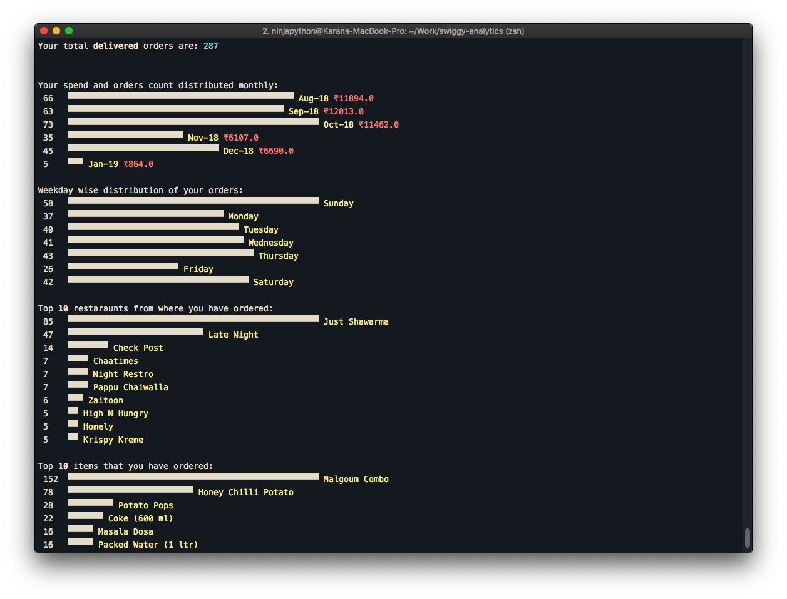
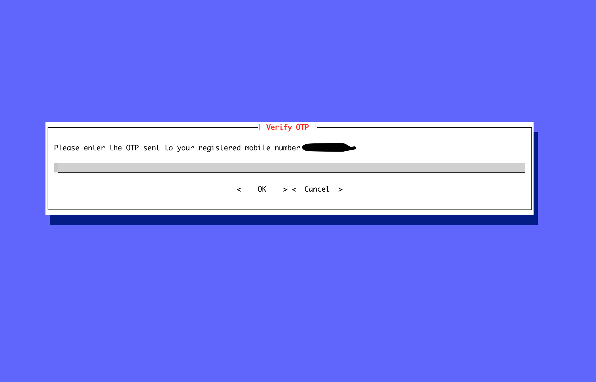
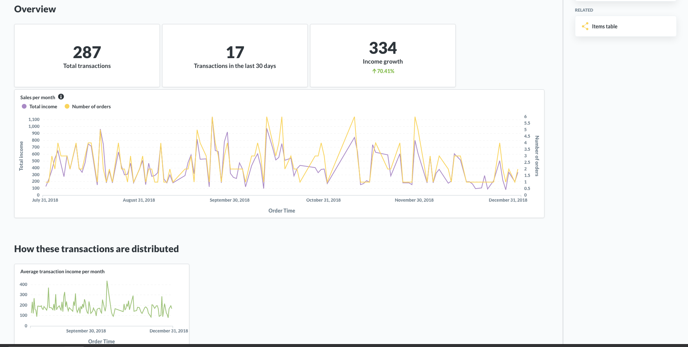
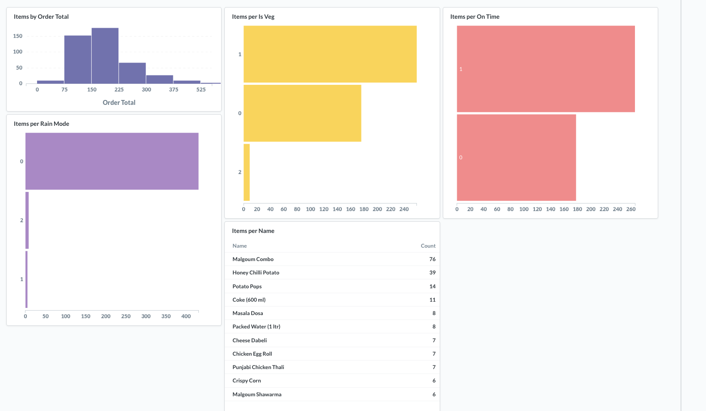

# swiggy-analytics

[](https://pypi.org/project/swiggy-analytics/)
[](https://raw.githubusercontent.com/mr-karan/fate/master/LICENSE)



`swiggy-analytics` is CLI for fetching past orders from Swiggy and storing them in a local `SQLLite` DB. It also displays basic stats on your order history in the terminal, such as your most frequently order dish, your monthly expenditure, weekday wise distribution of orders and much more. For more advanced users, who wish to perform their own analysis, can do so by using the `sqlite3` db file which is generated.

_NOTE_: **Only** supported by Python3. Seriously, if you're still using Python2, _please_ [STOP](https://pythonclock.org/). I've tested it on Python3.5+ on OSX and Ubuntu 18.04 Vagrant machine.

## Important Disclaimer

This tool needs to login to your Swiggy account and fetch the order history. The account username lives on your local file system. If you don't feel comfortable entering these details, you can audit the code yourself to be sure that this information is not used in any evil way. There's an OTP which is sent to your registered mobile number, which is required everytime you fetch orders. Cheers!

## Getting Started

### Installation

`pip install swiggy-analytics`

### Setting up account

If you run `swiggy-analytics` for the first time, it will prompt you for your registered mobile number. An OTP will be sent to your phone and after the session is authenticated, a file `.swiggy-analytics-config.ini` is created in your home directory. The file contains your username to your Swiggy account, so you don't have to re-enter this detail everytime you run the tool.



You can also regenrate your config file by explictly passing the flag with the command executable, such as: `swiggy-analytics --configure`

**NOTE**: Username is your phone number which you have registered with your Swiggy account.

### Quickstart

```sh
swiggy-analytics --save
```


-   If you want to persist the orders data to a local database, you should use the `--save` flag. This option would generate a `swiggy.db` file in your current working directory.
-   In case you just want to run it once and see basic stats, you can skip
    this flag and the tool will hold the data in an in memory DB which would last only till the program is running.

## Advanced

You can write your own SQL queries by importing `swiggy.db` in your DB tool. I personally used Metabase and setup a dashboard with interesting charts presenting patterns on my ordering behaviour.




## Credits

-   [@knadh](https://github.com/knadh) for the [`print_bars`](https://github.com/knadh/git-bars/blob/master/gitbars/gitbars.py#L24) function which is used to draw simple bar graph on the terminal.
-   [Python Prompt Toolkit](https://python-prompt-toolkit.readthedocs.io/en/master/) for helping me flesh out a good looking CLI so easily! <3 this library.

## Contribution

PRs on Feature Requests, Bug fixes are welcome. Feel free to open an issue and have a discussion first.

## License

[MIT](license)

### Disclaimer

This tool is only intended for personal use and is a simple demonstration. It is in open domain and I am not responsible if you use it and violate any TnC. Or as they say,
it's **for science**.
